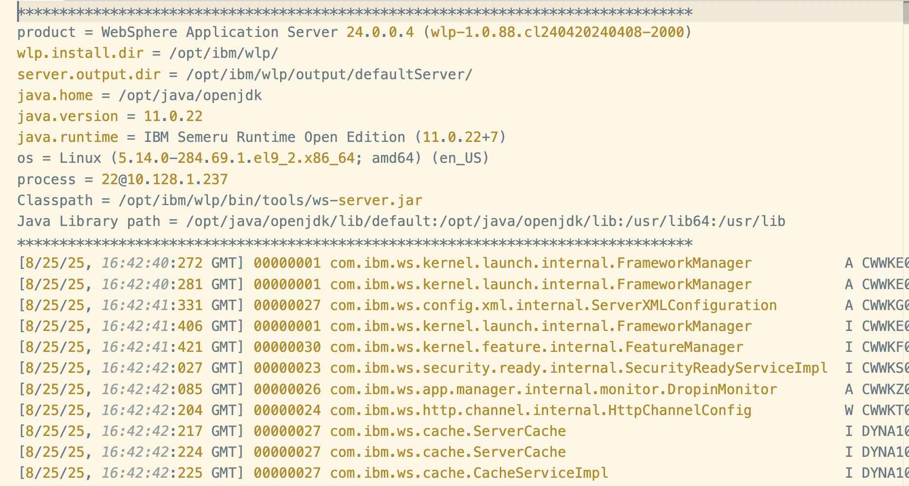

# MAS Tools API VS Code Extension

This extension provides a convenient way to interact with the [MAS Tools API](https://www.ibm.com/docs/en/masv-and-l/maximo-manage/8.3.0?topic=suite-apis-administrative-utilities) directly from within Visual Studio Code. Typically users need to use Postman or other tools to set up API end point and keys. Certain features like fetching logs files are not very convenient in Postman. This extension solves all these problems.

## Features

This extension provides following features using MAS Tools API:

*   **Setup:**
    1. One-time setup command to securely store your MAS End Point URL, Maxinst Pod's URL and API Key.
    2. Ability to verify environment before running the command and change environment.
       
*   **API :** Access to all the MAS Tools API endpoints through the VS Code command palette -

    1. Start Manage
    2. Stop Manage
    3. Upload Manage log in S3
    4. Stream Manage Logs
    5. Get all tool logs and click to fetch individual log
    6. Generate Integirty Checker Log
    7. Read Integity Checker Log

## Features

### Setup

*  Go to Visual Studio Marketplace and search for MAS Tools API and Install the Plugin -

*  Once installed, press:
    ctrl+shift+p in Windows
    cmd+shift+p in Mac

*  Search MAS Tools API and You'll see following menu:

*  From Menu click on "MAS Tools API: Setup", provide MAXINST URL for your Maximo environment and hit Enter:

*  Provide Manage URL and hit Enter:

* Create API Key for your user in MAS Manage and provide API Key and hit Enter:

This will complete the setup and message in right hand corner you will see message for configuration is saved.

### Start Manage

* To Start Manage, choose Option - "MAS Tools API: Start Manage Pods" from Search bar.

You'll see a poup with MAXINST and Manage URL to confirm you are going to run command for desired environment.

Click "Continue" if you want to proceed further.
If Environment is not correct then click on "Change Environment" button and resetup Environment.

You'll see pop up in right hand corner success message and MAS Pods will start in few mins.

### Stop Manage

* To Stop Manage, choose Option - "MAS Tools API: Stop Manage Pods"  from Search bar.
First environment confirmation dialog will open. If continue, you'll see pop up in right hand corner success message and MAS Pods will stop in few mins.

### Upload Manage log in S3

* To Start Manage, choose Option - "MAS Tools API: Upload Logs to S3" from Search bar.

First environment confirmation dialog will open. If continue, you'll see pop up in right hand corner showing success message. File# uploaded for the API call will also be displyed.

### Stream Manage Logs

* To Start Manage, choose Option - "MAS Tools API: Stream MAS Manage Logs" from Search bar.
First environment confirmation dialog will open. If continue, you'll see new log file from Steam log.
Run Stream Manage Logs again and it will show updated logs.

### Get all tool logs and click to fetch individual log

* To Start Manage, choose Option - "MAS Tools API: Get All Tools Logs" from Search bar.
First environment confirmation dialog will open. If continue, you'll see list of all logs available in new file.

Click on File Name and it will fetch the log file and open as shown below:

### Generate Integirty Checker Log

* To generate Integrity Checker log, choose Option - "MAS Tools API: Generate Integrity Check Report" from Search bar.
First environment confirmation dialog will open. If continue, you'll list of IC log generated.

### Read Integity Checker Log

* To read Interity Checker log,click on File Name and it will fetch the Integirty Checker Report file and open as shown below:

## Troubeshooting

* In case of any error, it will be shown in right hand side pop up on the screen.
* Setup Environmen details again from option "MAS Tools API: Setup".

